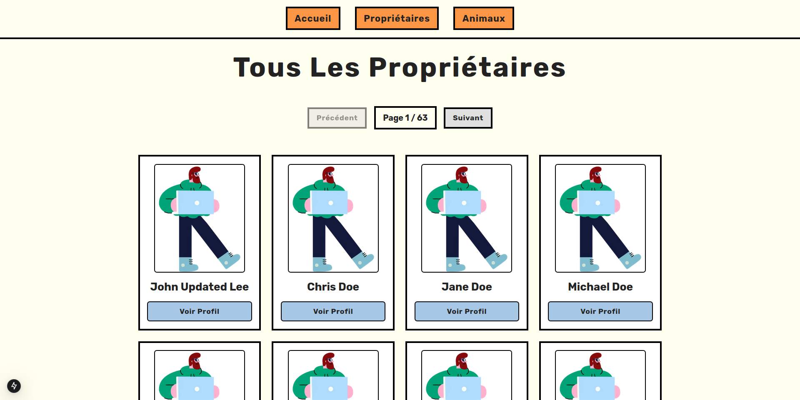

# Test Technique



## Fonctionnalités du Projet

- **Accès à tous les propriétaires et animaux** : L'application permet de consulter la liste complète des personnes et des animaux enregistrés dans la base de données MySQL.
- **Pages individuelles pour chaque propriétaireet chaque animal** : Chaque propriétaire et chaque animal a sa propre page avec ses informations détaillées.
- **Système de pagination** : Afin de faciliter la navigation, un système de pagination est intégré pour afficher les données de manière organisée et permettre une navigation rapide.
- **Site responsive** : L'application est entièrement responsive, garantissant une expérience utilisateur optimale sur tous les types d'appareils (ordinateurs, tablettes, mobiles).
- **Données stockées dans MySQL** : Les informations des propriétaires et des animaux sont stockées dans une base de données MySQL, garantissant une gestion structurée et fiable des données.
- **Backend avec NestJS et API GraphQL** : Le serveur est construit avec **NestJS**, un framework Node.js robuste. Les données sont transmises au frontend via une API **GraphQL**, offrant ainsi une manière flexible et efficace de récupérer les données.


## Technologies utilisées

- **TypeScript**
- **NestJS**
- **NextJS**
- **MySQL** 
- **GraphQL**
- **Tailwind CSS**

## Installation

### Avant de commencer, assurez-vous d'avoir installé les outils suivants :

1. **Node.js** : Téléchargez et installez Node.js depuis [ici](https://nodejs.org).
2. **NestJS CLI** : Installez-le avec la commande suivante :
   ```bash
   npm install -g @nestjs/cli

3.   MySQL : Installez et configurez MySQL sur votre machine. Vous pouvez le télécharger depuis [ici](https://dev.mysql.com/downloads/installer/).

Étapes pour configurer le projet

Clonez ce repository sur votre machine :

      git clone https://github.com/awenBourdon/Test_Technique_Tkorp.git

Allez dans le dossier du projet :

    cd technical-test

Connectez-vous à MySQL via le terminal (exemple avec root):

      mysql -u root -p

Créez une nouvelle base de données (exemple avec technical_test) :

      CREATE DATABASE technical_test;

Sélectionnez la :

      USE technical_test;

Créez la table person :

      CREATE TABLE person (
          id INT AUTO_INCREMENT PRIMARY KEY,
          lastName VARCHAR(255) NOT NULL,
          firstName VARCHAR(255) NOT NULL,
          email VARCHAR(255) NOT NULL UNIQUE,
          phoneNumber VARCHAR(50) NOT NULL
      );

Créez la table animal :

      CREATE TABLE animal (
          id INT AUTO_INCREMENT PRIMARY KEY,
          name VARCHAR(255) NOT NULL,
          dateOfBirth DATE NOT NULL,
          species VARCHAR(255) NOT NULL,
          breed VARCHAR(255) NOT NULL,
          color VARCHAR(255) NOT NULL,
          weight DECIMAL(10, 2) NOT NULL,
          ownerId INT,
          FOREIGN KEY (ownerId) REFERENCES person(id) ON DELETE SET NULL
      );

Quittez MySQL :

    EXIT;

Dans le terminal vous n'avez plus qu'à intégrer les données en rentrant :

     mysql -u root -p < data-SQL.txt

Pour vérifier sur MySQL si les données ont bien été rentrées :

     SELECT * FROM person;
     SELECT * FROM animal;

## Paramétrage des variables d'environnement

Dans le dossier backend, créez un fichier .env et ajoutez les informations suivantes :

    MYSQL_USERNAME= (votre identifiant)
    MYSQL_PASSWORD= (votre mot-de-passe)
    MYSQL_DB_NAME= (le nom de votre base de donnée)
    MYSQL_PORT= (le port de votre base de donnée)
    PORT= (le port que vous souhaitez utiliser pour NestJS/GraphQL)

Démarrer le Backend

Allez dans le dossier backend :

      cd backend

Installez les dépendances :

      npm install

Démarrez l'application NestJS :

    nest start --watch

Ouvrez votre navigateur et accédez à http://localhost:(le PORT que vous avez défini). Vous devriez voir le message "Hello Tkorp".

## Démarrer le Frontend (NextJS)

Allez dans le dossier frontend :

      cd frontend

Installez les dépendances :

      npm install

Créez un fichier .env dans le dossier frontend et ajoutez l'URL de votre API GraphQL :

      NEXT_PUBLIC_GRAPHQL_URI=http://localhost:(le PORT que vous avez défini précédemment)/graphql

Démarrez l'application NextJS :

    npm run dev

Ouvrez votre navigateur et allez sur http://localhost:3000 pour voir le frontend.

# Important : Par défaut, NextJS utilise le port 3000. Si vous modifiez ce port, n'oubliez pas de mettre à jour l'URL dans le fichier main.ts de votre backend pour qu'elle corresponde au nouveau port.

## N'hésitez pas à regarder le fichier GraphQL.Commands.txt pour voir les différentes commandes pour intéragir avec données depuis GraphQL Playground ou depuis NextJS

# Réponses aux questions :

- **Quel animal est le plus vieux ?** Rocky (Id 934)

      SELECT * FROM animal ORDER BY dateOfBirth ASC LIMIT 1;

- **Quelle espèce est la mieux représentée ? (Le plus d’entités de cette espèce)** Bird

      SELECT species, COUNT(*) AS count
      FROM animal
      GROUP BY species
      ORDER BY count DESC
      LIMIT 1;

- **Qui possède le plus d’animaux ?** Sophia Brown (Id 18)

      SELECT p.id AS ownerId, p.firstName, p.lastName, COUNT(*) AS animal_count
      FROM animal a
      JOIN person p ON a.ownerId = p.id
      GROUP BY a.ownerId
      ORDER BY animal_count DESC
      LIMIT 1;


- **Qui possède le plus de chats ?** Sarah White (Id 268)

      SELECT p.id AS ownerId, p.firstName, p.lastName, COUNT(*) AS cat_count
      FROM animal a
      JOIN person p ON a.ownerId = p.id
      WHERE a.species = 'Cat'
      GROUP BY p.id
      ORDER BY cat_count DESC
      LIMIT 1;


- **Qui possède l’animal le plus lourd ? Comment s’appelle cet animal et quel est son poids ?** Emma Smith (Id 209) qui possède Chloe (Id 821) pour un poids de 49,94 kg

      SELECT a.id AS animalId, a.name AS animalName, a.weight AS animalWeight, p.id AS ownerId, p.firstName, p.lastName
      FROM animal a
      JOIN person p ON a.ownerId = p.id
      ORDER BY a.weight DESC
      LIMIT 1;

- **Qui possède le groupe d’animaux le plus lourd ? Quel est le poids total de ce groupe d’animaux ?** Sophia Brown (18) avec un total de 172 kg.

      p.firstName, p.lastName, a.ownerId, SUM(a.weight) AS total_weight
      FROM animal a
      JOIN person p ON a.ownerId = p.id
      GROUP BY a.ownerId
      ORDER BY total_weight DESC
      LIMIT 1;


